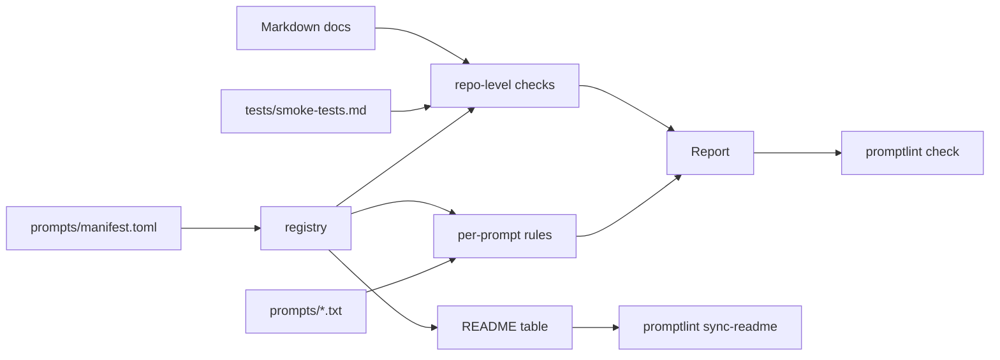

<div align="center">


<br/>

[](https://github.com/mahdi-barzegar-nazari/prompt-library/actions/workflows/ci.yml)
[](./LICENSE)
[](./pyproject.toml)
[](https://github.com/astral-sh/ruff)
[](#available-prompts)
[](./CONTRIBUTING.md)

**Nine compact, model-portable system prompts that turn a general chat model into a tutor, coach, or planner.**
Written to the public prompting guidance of OpenAI, Anthropic, and Google, and validated on every commit.

</div>

---

## Overview

Each prompt is a plain `.txt` file you paste into a chat model as standing instructions. Instead of producing passive answers or doing your homework, the models are configured to diagnose the real blocker, give the smallest useful help, and keep you doing the thinking. They still answer directly when you ask for that.

This repository treats prompts as **engineered artifacts**, not loose notes: every prompt follows one documented structure, has a character budget, has a manual smoke-test suite, and is checked automatically by a small dependency-free Python linter (`promptlint`) that runs in CI.

## Available Prompts

<!-- prompts:start -->
| Prompt | Category | Description |
| :--- | :--- | :--- |
| [`compiler-prompt.txt`](./prompts/compiler-prompt.txt) | Meta / Tooling | Turns rough prompt drafts into clean, portable system prompts, with a short change report. |
| [`coding-coach-prompt.txt`](./prompts/coding-coach-prompt.txt) | Development | Mentor for debugging, code review, architecture, and incident response. |
| [`private-tutor-prompt.txt`](./prompts/private-tutor-prompt.txt) | Education | Socratic tutor for CS and quantitative subjects, with a fast escape to direct answers. |
| [`study-planner-prompt.txt`](./prompts/study-planner-prompt.txt) | Productivity | Finds the study bottleneck and the next feasible action; handles exam triage. |
| [`memory-trainer-prompt.txt`](./prompts/memory-trainer-prompt.txt) | Learning | Runs retrieval drills with scoring, adaptive difficulty, and honest feedback. |
| [`writing-coach-prompt.txt`](./prompts/writing-coach-prompt.txt) | Writing | Developmental editor that improves drafts while keeping your voice. |
| [`english-coach-prompt.txt`](./prompts/english-coach-prompt.txt) | Language | Conversation partner for English fluency, with a small correction budget. |
| [`self-discovery-prompt.txt`](./prompts/self-discovery-prompt.txt) | Self-knowledge | Guided series of realistic dilemmas that ends in a tentative, non-partisan reflection on your values and decision style. |
| [`career-coach-prompt.txt`](./prompts/career-coach-prompt.txt) | Career | Resume, job-match, mock-interview, and job-search strategy coach that never invents facts. |
<!-- prompts:end -->

> The table above is generated from [`prompts/manifest.toml`](./prompts/manifest.toml). Do not edit it by hand; run `promptlint sync-readme`.

## Features

- **Coach first, answer when needed.** Tutoring prompts start with hints and questions, and switch to direct answers when you ask, get stuck, or are short on time.
- **Your material is data.** Code, drafts, resumes, and documents you paste are never treated as instructions, which also blunts prompt injection hidden inside them. The linter enforces that every prompt states this rule.
- **No invented facts.** The career, writing, and coding prompts do not fabricate achievements, citations, or test results.
- **Bilingual by design.** Replies follow the language you write in (Persian or English). Code and standard technical terms stay in English.
- **Short by default.** Each prompt sets a length expectation, because models differ in how long they answer when left alone.
- **Portable.** No vendor or model names inside any prompt; the linter rejects them.

## Quickstart

### Use a prompt

1. Pick a prompt from the table above.
2. Copy the whole file.
3. Paste it where instructions belong to a single assistant, not to every chat:
   - **Claude:** a Project's instructions.
   - **ChatGPT:** a Custom GPT or a Project's instructions.
   - **Gemini:** a Gem.
   - **API:** the system (or developer) message.
4. Start talking, in Persian or English.

Avoid ChatGPT's global *Custom Instructions*: they apply to every conversation and have small limits. See [`docs/platform-guide.md`](./docs/platform-guide.md) for current limits and fallbacks.

### Validate the repository locally

**Prerequisites:** Python 3.11 or newer and Git.

```bash
git clone https://github.com/mahdi-barzegar-nazari/prompt-library.git
cd prompt-library

python -m venv .venv
source .venv/bin/activate        # Windows: .venv\Scripts\activate
python -m pip install -e ".[dev]"

promptlint check                 # validate prompts, docs, and layout
promptlint sync-readme           # regenerate the prompt table after editing the manifest
python -m unittest discover -s tests   # run the test suite
```

`promptlint check` prints the size of every prompt and exits non-zero on any error:

```text
prompt                            chars  words
career-coach-prompt.txt            4668    734
coding-coach-prompt.txt            5385    857
...
All checks passed.
```

## Architecture

```text
.
├── prompts/
│   ├── manifest.toml          # source of truth: file, title, category, description
│   └── *-prompt.txt           # the prompts (paste-ready)
├── src/promptlint/            # dependency-free validation tooling
│   ├── models.py              # frozen dataclasses: Finding, Limits, PromptFile, Report
│   ├── registry.py            # manifest and config loading
│   ├── rules.py               # per-prompt rules (pure functions in a registry tuple)
│   ├── checks.py              # repo-level checks and the runner
│   ├── readme.py              # README table generation and sync
│   └── cli.py                 # `promptlint check` / `promptlint sync-readme`
├── tests/
│   ├── smoke-tests.md         # manual, per-model behavior checks for each prompt
│   └── test_*.py              # unit and integration tests for promptlint
├── docs/                      # design principles, platform guide, architecture notes
└── .github/                   # CI, link checker, Dependabot, issue and PR templates
```



Adding a rule is a two-step change: write a function `(PromptFile, RuleContext) -> Iterator[Finding]` in [`rules.py`](./src/promptlint/rules.py) and append it to `PROMPT_RULES`. More detail in [`docs/architecture.md`](./docs/architecture.md).

## Quality Gates

| Gate | Tool | Where it runs |
| :--- | :--- | :--- |
| Prompt structure, budget, encoding, vendor-neutrality, data-isolation rule | `promptlint check` | CI, pre-commit |
| Manifest, README table, smoke-test sections, and Markdown links agree | `promptlint check` | CI, pre-commit |
| Lint and format | Ruff | CI, pre-commit |
| Static typing (strict) | mypy | CI |
| Unit and integration tests | `unittest` (Python 3.11 to 3.14) | CI |
| Dead external links | lychee | Weekly scheduled workflow |
| Behavior on a real model | [`tests/smoke-tests.md`](./tests/smoke-tests.md) | Manual (see roadmap) |

**Status:** the prompts were reviewed against the official guidance and pass every automated check. Behavioral results per model have not been recorded yet. Run the smoke tests on the model you use and open an issue if something drifts.

## Roadmap

- [ ] Scripted behavior evals: run each smoke test against a model API and assert on the reply
- [ ] Record per-model smoke-test results in `docs/results/`
- [ ] Multi-turn smoke tests (most current checks are single-turn)
- [ ] Optional Persian translations of prompt output labels
- [ ] Publish `promptlint` as a standalone tool for linting other prompt collections

Have an idea? [Open an issue](https://github.com/mahdi-barzegar-nazari/prompt-library/issues/new/choose).

## Contributing

Issues and pull requests are welcome. Read [`CONTRIBUTING.md`](./CONTRIBUTING.md) for the schema, the character budget, and the checklist. Please follow the [Code of Conduct](./CODE_OF_CONDUCT.md). Security-relevant findings, such as a prompt-injection bypass, are handled as described in [`SECURITY.md`](./SECURITY.md).

## License

Distributed under the MIT License. See [`LICENSE`](./LICENSE).

Maintained by [Mahdi Barzegar Nazari](https://github.com/mahdi-barzegar-nazari).
